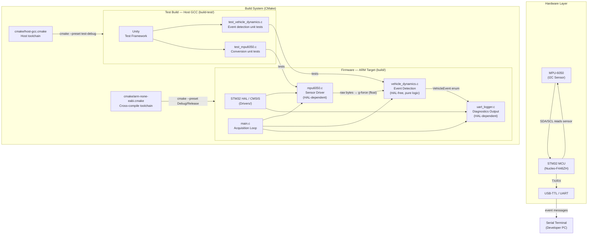
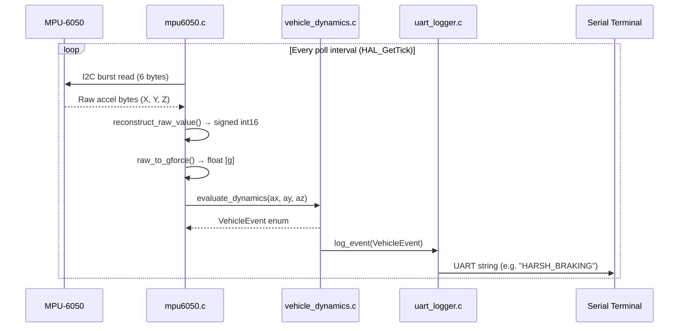
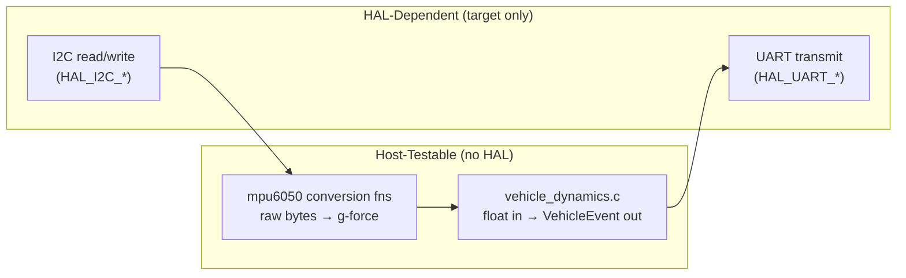
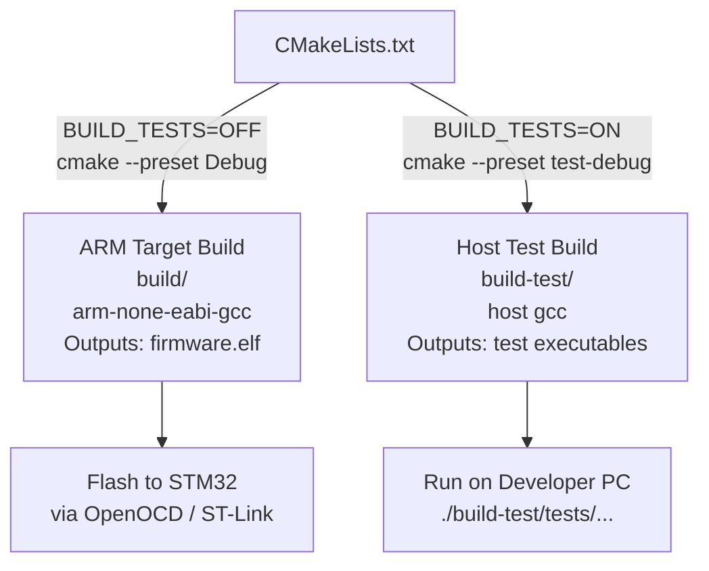

# Vehicle Dynamics Monitor — Architecture

## System Architecture

---

## Data Flow

---

## Layer Boundaries

> **Key architectural rule:** `vehicle_dynamics.c` contains zero HAL calls. Pure `float` in, `VehicleEvent` enum out. This boundary is what makes TDD on the host possible without mocking the entire HAL.

---

## CMake Build Configurations

